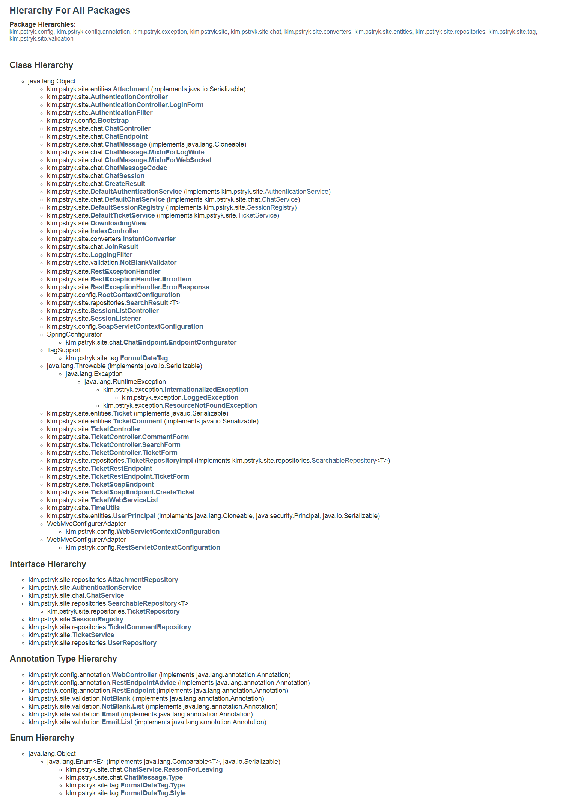
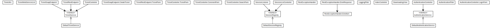
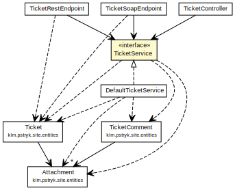
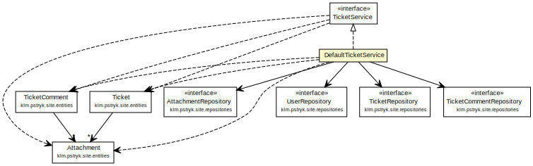

# **klmsupport**
# **Enterprise-level Customer Support Application**

**Package hierarchy looks like this:**


**Package klm.pstryk.site looks like this:** (To see it in a large view you need to open the grafic in another window.)



**TicketService looks like this:**



**And DefaultTicketService looks like this:**




## Model View Controler plus Controller Service Repository pluse Spring Data JPA
Here goes some theory...

## The initial flow of the process
Initial point is in the file IndexController.java:
```java
@WebController
public class IndexController
{
    @RequestMapping("/")
    public View index()
    {
        return new RedirectView("/ticket/list", true, false);
    }
}
```
where a user is transferred to TicketController, where tickets are retrieved from the data source (in my case the MySQL database) using ticketService interface:
```java
@RequestMapping(value = {"", "list"}, method = RequestMethod.GET)
public String list(Map<String, Object> model)
{
    log.debug("Listing tickets.");
    model.put("tickets", this.ticketService.getAllTickets());

    return "ticket/list";
}
```
Then **JstlView** maps *ticket/list* to *web/WEB-INF/jsp/view/ticket/list.jsp*, where user gets a listing of all tickets. In the view EL variable tickets is used:
```jsp
<%--@elvariable id="tickets" type="java.util.List<klm.pstryk.site.entities.Ticket>"--%>
<spring:message code="title.ticketList" var="listTitle" />
<template:basic htmlTitle="${listTitle}" bodyTitle="${listTitle}">
    <c:choose>
        <c:when test="${fn:length(tickets) == 0}">
            <i><spring:message code="message.ticketList.none" /></i>
        </c:when>
        <c:otherwise>
            <c:forEach items="${tickets}" var="ticket">
                <spring:message code="message.ticketList.ticket" />&nbsp;${ticket.id}:
                <a href="<c:url value="/ticket/view/${ticket.id}" />">
                <c:out value="${pstryk:abbreviateString(ticket.subject, 60)}"/>
                </a><br />
                <c:out value="${ticket.customer.username}" />&nbsp;
                <spring:message code="message.ticketList.created" />&nbsp;
                <pstryk:formatDate value="${ticket.dateCreated}" type="both"
                                 timeStyle="short" dateStyle="medium" /><br />
                <br />
            </c:forEach>
        </c:otherwise>
    </c:choose>
</template:basic>
```
Here goes a sequence diagram...

## Some Entities relationship
One-To-Many:
- Ticket to Attachment*s*
- TicketComment to Attachment*s*
- UserPrincipal to Ticket*s*
- UserPrincipal to TicketComment*s*

The joining mapping of the Ticket and Attachment is:
```java
@OneToMany(fetch = FetchType.LAZY, cascade = CascadeType.ALL,
        orphanRemoval = true)
@JoinTable(name = "Ticket_Attachment",
        joinColumns = { @JoinColumn(name = "TicketId") },
        inverseJoinColumns = { @JoinColumn(name = "AttachmentId") })
@OrderColumn(name = "SortKey")
@XmlElement(name = "attachment")
@JsonProperty
public List<Attachment> getAttachments()
{
    return this.attachments;
}
```
The joining mapping of the TicketComment and Attachment is:
```java
@OneToMany(fetch = FetchType.EAGER, cascade = CascadeType.ALL,
        orphanRemoval = true)
@JoinTable(name = "TicketComment_Attachment",
        joinColumns = { @JoinColumn(name = "CommentId") },
        inverseJoinColumns = { @JoinColumn(name = "AttachmentId") })
@OrderColumn(name = "SortKey")
@XmlElement(name = "attachment")
@JsonProperty
public List<Attachment> getAttachments()
{
    return this.attachments;
}
```
While listing tickets there is no need to list their attachments and that is the reason of lazy loading. But when the chosen ticket is being viewed its attachments need to be loaded. And I achieve that inside *DefaultTicketService* by calling a method *getNumberOfAttachments()* on the attachment list during the transaction. This method calls the *size* method of the *List<Attachment>* and thanks to it Hibernate loads the attachments for the individually retrieved ticket.
```java
@Override
@Transactional
public Ticket getTicket(long id)
{
    Ticket ticket = this.ticketRepository.findOne(id);
    ticket.getNumberOfAttachments();
    return ticket;
}
```
The different situation is when listing the comments while viewing a ticket, attachments of every comment need to be loaded immediately. So they must be loaded eagerly.
  
Here goes some theory of lazy loading simple properties with load time weaving...


# Summary:
There are in the project several other interesting functionalities like searching or chatting, but I'm not gonna describe them now. I would gladly provide the description orally during an interview. The project is still in-progress, I will:
- improve authentication using Spring Security, 
- expand an user interface (additional JSP tags),
- improve an user interface (probably Bootstrap, maybe try different template engine),
- improve RESTful and SOAP web services,
- provide thorough coverage of tests,
- improve a class diagram and provide a sequence diagram,
- expand this documentation.
TO BE CONTINUED...
